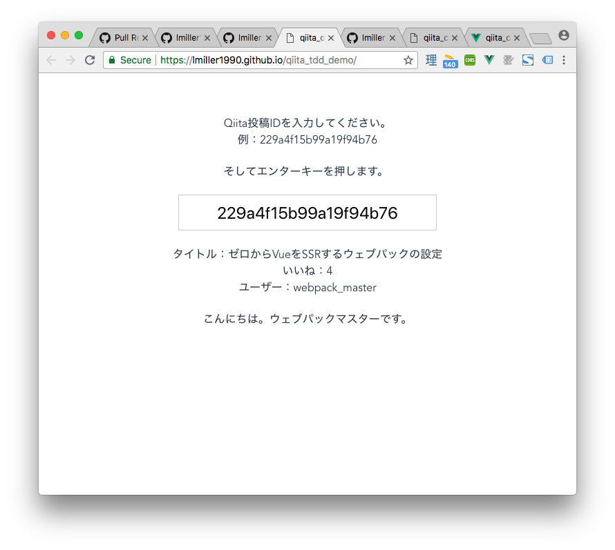

この記事でQiita APIとVueを使って、TDDでQiitaの投稿の情報を表示するコンポーネントを作ります。

## なぜTDD？（テスト駆動開発）

エンジニアは、作るものを正しく行動するためにテストします。例：

- 車を製造するエンジニアは安全のためにブレーキをテストします
- 充電をデザインエンジニアはシミュレーションで爆発するかテストします
- プログラムを書く人は・・・とりあえず使ってみてどうなるかみてみようかな？

「使ってみる」はいいテストする方法ではないです。コントロールできる環境で確認した方が安全です。

## 何を作る？

このアプリケーションをTDDで開発します。Qiitaの投稿IDを入力すると、ユーザー、いいね、などを表示します。[ライブバージョンはここにある](https://lmiller1990.github.io/qiita_tdd_demo/)ので試してみてください。



## 環境設定

`vue-cli`をインストールします。

```
yarn global add @vue/cli
```

そして新しいプロジェクトを作ります：

```
vue create qiita_component
```

オプしションは`babel`と`jest`。

## 条件

- `id`をテキストボックスに入力する
- `id`でapiを叩く
- レスポンスを表示する

この３つの条件をそれぞれのコンポーネントに分けます。

- `id`を受け取る -> `PostForm.vue`
- api叩く -> `PostContainer.vue`
- レスポンスを表示する -> `PostDisplay.vue`

さらに、コンポーネントの役割を考えてみましょう。

- `PostForm.vue`
  - ユーザーの入力を受け取る
  - 入力を`PostContainer.vue`に渡す

- `PostDisplay.vue`
  - データを受け取って(`props`として？)
  - データを表示する

- `PostContainer.vue`
  - `PostForm.vue`から`id`を受け取る
  - apiを叩く
  - レスポンスを`PostDisplay.vue`に渡す(`props`がいいかも)

`PostContainer`のノートを見ると、`PostForm`と`PostDisplay`も入っているので、この構成がいいとわかります：

```
<PostContainer>
  <PostForm />     入力を`$emit`でPostContainerに渡す
  <PostDisplay />  `props`として投稿のデータを受け取る
</PostContainer>

この記事で`PostForm.vue`と`PostDisplay.vue`を作ります。次の記事で`PostContainer.vue`を作ります。


何をどこでやるを決めたので、開発しましょう。

## `PostForm.vue`

テストファイルを作ります。

```
touch tests/unit/PostForm.spec.js
```

とりあえず、`PostForm`をレンダーしてみます。

```js
import { shallowMount } from "@vue/test-utils"
import PostForm from "../../src/PostForm.vue"

describe("PostForm", () => {
  it("renders", () => {
    const wrapper = shallowMount(PostForm)

    console.log(wrapper.html())
  })
})
```

[`shallowMount`](https://vue-test-utils.vuejs.org/ja/api/#shallowmount)を使ってコンポーネントをレンダーします。`yarn test:unit`を実行して、エラーに合わせて開発しましょう。

```
Cannot find module '../../src/PostForm.vue' from 'PostForm.spec.js'

  1 | import { shallowMount } from "@vue/test-utils"
> 2 | import PostForm from "../../src/PostForm.vue"
    | ^
  3 |
  4 | describe("PostForm", () => {
  5 |   it("renders", () => {
```

まだ作成してないので、`import`もできないですね。作成します：

```
touch src/PostForm.vue
```

テストを実行したら、別のエラーができます。

```
[Vue warn]: Failed to mount component: template or render function not defined.
```

`template`がないので、`template or render function not defined`が出ました。`template`を作ります。

```vue
<template>
  <div class="wrapper">
  </div>
</template>
```

エラーがなくなりました。

```
 PASS  tests/unit/PostForm.spec.js
  PostForm
    ✓ renders (39ms)
```

上に書いてある条件を参考します：

- ユーザーの入力を受け取る
- 入力を`PostContainer.vue`に渡す

２つのテストが必要です。

### 入力を受け取るテスト

テストを書きましょう。ユーザーから入力を受け取って、`data`にある変数にアサインしたいです。

- ユーザーの入力を[`setValue`](https://vue-test-utils.vuejs.org/api/wrapper/#setvalue-value)でシミュレーションできます
- `input`で入力を受け取る（当たり前）

その２つのことを考えながらテストを書いてみましょう。

```js
import { shallowMount } from "@vue/test-utils"
import PostForm from "../../src/PostForm.vue"

describe("PostForm", () => {
  // ...

  it("ユーザーから入力を受け取る", () => {
    const wrapper = shallowMount(PostForm, {
      data() {
        return { postId: '' }
      }
    })

    wrapper.find("input").setValue("123")

    expect(wrapper.vm.postId).toBe("123")
  })
})
```

実行して：

```
[vue-test-utils]: find did not return input, cannot call setValue() on empty Wrapper
```

`input`は存在してないので、`find`ができません。作成します：

```vue
<template>
  <div class="wrapper">
    <input />
  </div>
</template>
```

別のエラーが出ます：

```
expect(received).toBe(expected) // Object.is equality

    Expected: "123"
    Received: undefined
```

`undefined`となっているので、`data`に追加します。

```vue
<template>
  <div class="wrapper">
    <input />
  </div>
</template>

<script>
export default {
  data() {
    return { postId: "" }
  }
}
</script>
```

```
expect(received).toBe(expected) // Object.is equality

    Expected: "123"
    Received: ""
```

`""`になりました。最後に`v-model`でバインドします。

```vue
<template>
  <div class="wrapper">
    <input v-model="postId" />
  </div>
</template>

<script>
export default {
  data() {
    return { postId: '' }
  }
}
</script>
```

```
 PASS  tests/unit/PostForm.spec.js
  PostForm
    ✓ renders (39ms)
    ✓ ユーザーから入力を受け取る (25ms)
```

### 入力したデータを親に`$emit`する

ユーザーが入力して、エンターを押すと投稿IDをペイロードとしてイベントを`$emit`したいです。そうすると、親の`PostContainer`はその入力したデータでAPIを叩いて、レスポンスをもらいます。

- [`trigger`](https://vue-test-utils.vuejs.org/api/wrapper/#trigger-eventtype-options)でエンターキーをシミュレーションができます。
- [`emitted`](https://vue-test-utils.vuejs.org/api/wrapper/#emitted)でイベントを`$emit`したか確認できます。

先にテストを書きます。

```js
import { shallowMount } from "@vue/test-utils"
import PostForm from "../../src/PostForm.vue"

describe("PostForm", () => {
  // ...

  it("エンターキーを押すとsubmitイベントを$emit", () => {
    const wrapper = shallowMount(PostForm)

    wrapper.find("input").setValue("123")
    wrapper.find("input").trigger("keyup.enter")

    expect(wrapper.emitted("submit")[0][0]).toBe("123")
  })
})
```

`emitted`のシンタックスがちょっとわかりづらいです。`console.log(wrapper.emitted())`で遊んでみた方がわかりやすいと思います。[ドキュメントを読むことも良いです](https://vue-test-utils.vuejs.org/api/wrapper/#emitted)。

テストを実行します：

```
TypeError: Cannot read property '0' of undefined
```

なぜかというと、イベントを`$emit`していないので、`emitted()`は`undefined`。エンターキーに`@keyup.enter`を追加して、`$emit`してみます。

```vue
<template>
  <div class="wrapper">
    <input v-model="postId" @keyup.enter="handleSubmit" />
  </div>
</template>

<script>
export default {
  data() {
    return { postId: '' }
  },

  methods: {
    handleSubmit() {
      this.$emit("submit")
    }
  }
}
</script>
```

別のエラーが出ます。

```
Expected: "123"
    Received: undefined
```

イベントを`$emit`しているが、ぺうロードはまだ`undefined`。追加してみます：

```vue
<template>
  <div class="wrapper">
    <input v-model="postId" @keyup.enter="handleSubmit" />
  </div>
</template>

<script>
export default {
  data() {
    return { postId: '' }
  },

  methods: {
    handleSubmit() {
      this.$emit("submit", this.postId)
    }
  }
}
</script>
```

```
 PASS  tests/unit/PostForm.spec.js
  PostForm
    ✓ renders (39ms)
    ✓ ユーザーから入力を受け取る (25ms)
    ✓ エンターキーを押すとsubmitイベントを$emit (4ms)
```

成功です！全部の条件を完了させたので、進みます。

## PostDisplay

`PostDisplay`は：

- データを受け取って(`props`として？)
- データを表示する

新しいテストファイルとコンポーネントを作成します：

```
touch src/PostDisplay.vue && touch tests/unit/PostDisplay.spec.js
```

進む前に、「データ」について調べてみましょう。[このエンドポイントを使います](https://qiita.com/api/v2/docs#get-apiv2itemsitem_id)。とりあえずブラウザのコンソールで使ってみます。

```
fetch("https://qiita.com/api/v2/items/229a4f15b99a19f94b76")
.then(data => data.json())
.then(json => console.log(Object.keys(json)))


//=> ["rendered_body", "body", "coediting", "comments_count", "created_at", "group", "id", "likes_count", "private", "reactions_count", "tags", "title", "updated_at", "url", "user", "page_views_count"]
```

プレパティが１６個あります。表示したいものは

- `likes_count`
- `title`
- `user`
- `body`の最初の２つの文章

一個ずつプロップスとして受け取ってレンダーします。`body`だけをちょっと処理してからレンダーします。

テストを書きます：

```js
import { shallowMount } from "@vue/test-utils"
import PostDisplay from "../../src/PostDisplay.vue"

describe("PostDisplay", () => {
  it("renders", () => {
    const wrapper = shallowMount(PostDisplay)
  })
})
```

そして`yarn test:unit`:

```
[Vue warn]: Failed to mount component: template or render function not defined.
```

`PostDisplay.vue`にまだ何も書いてないので失敗します。書きましょう：

```vue
<template>
  <div>
  </div>
</template>

<script>
export default {

}
</script>
```

エラーがなくなりました。次は、`post`オブジェクトを作って、`propsData`で受け取ります。`vue-test-utils`で`props`をコンポーネントに渡したいときに`propsData`を使います。[ここに参考してください](https://vue-test-utils.vuejs.org/api/wrapper/#props)。

テストを書きましょう。テストのために`data-test-`属性を使います。普通のHTMLクラスでも大丈夫です。

```js
import { shallowMount } from "@vue/test-utils"
import PostDisplay from "../../src/PostDisplay.vue"

describe("PostDisplay", () => {
  const post = {
    title: "タイトル",
    likesCount: 10,
    user: "webpack_master",
    body: "これは投稿です。テスト駆動開発。楽しいです。"
  }

  it("renders", () => {
    const wrapper = shallowMount(PostDisplay, {
      propsData: {
        title: post.title,
        likesCount: post.likesCount,
        user: post.user,
        pageViewsCount: post.pageViewsCount,
        body: post.body
      }
    })

    expect(wrapper.find("[data-test-title]").text()).toBe("タイトル：" + post.title)
    expect(wrapper.find("[data-test-likesCount]").text()).toBe("いいね：" + post.likesCount)
    expect(wrapper.find("[data-test-user]").text()).toBe("ユーザー：" + post.user)
    expect(wrapper.find(".post-body").text()).toBe("これは投稿です。テスト駆動開発。")
  })
})
```

`body`だけのために`class="body"`を使います。特に理由がないですが、ただ例をあげたいです。`find`は`querySelector`と同じシンタックスを追加います。[ソースコードを見ると](https://github.com/vuejs/vue-test-utils/blob/71a2ac4e6aa5edcee1c562a426e2bcab83bed443/packages/test-utils/src/find-dom-nodes.js#L16)、`querySelector`を使っているかわかります。

実行すると：

```
FAIL  tests/unit/PostDisplay.spec.js
● PostDisplay › renders

  [vue-test-utils]: find did not return [data-test-title], cannot call text() on empty Wrapper

    21 |     })
    22 |
  > 23 |     expect(wrapper.find("[data-test-title]").text()).toBe("タイトル：" + post.title)
```

`data-test-title`は存在していないです。同時に`data-test`属性を全部追加します。

```vue
<template>
  <div>
    <div data-test-title>
    </div>
    <div data-test-likesCount>
    </div>
    <div data-test-user>
    </div>
    <div class="post-body">
    </div>
  </div>
</template>

<script>
export default {

}
</script>
```

また実行します：

```
FAIL  tests/unit/PostDisplay.spec.js
● PostDisplay › renders

  expect(received).toBe(expected) // Object.is equality

  Expected: "タイトル：タイトル"
  Received: ""

    21 |     })
    22 |
  > 23 |     expect(wrapper.find("[data-test-title]").text()).toBe("タイトル：" + post.title)
```

`props`として受け取って、レンダーしてみましょう。

```vue
<template>
  <div>
    <div data-test-title>
      タイトル：{{ title }}
    </div>
    <div data-test-likesCount>
    </div>
    <div data-test-user>
    </div>
    <div class="post-body">
    </div>
  </div>
</template>

<script>
export default {
  props: {
    title: {
      type: String,
      required: true
    }
  }
}
</script>
```

また実行します：

```
FAIL  tests/unit/PostDisplay.spec.js
● PostDisplay › renders

  expect(received).toBe(expected) // Object.is equality

  Expected: "いいね：10"
  Received: ""

    22 |
    23 |     expect(wrapper.find("[data-test-title]").text()).toBe("タイトル：" + post.title)
  > 24 |     expect(wrapper.find("[data-test-likesCount]").text()).toBe("いいね：" + post.likesCount)
```

`likesCount`まで進みました。`post.title`はちゃんとレンダーしています。残りの`props`を同じように書いてみます：

```vue
<template>
  <div>
    <div data-test-title>
      タイトル：{{ title }}
    </div>
    <div data-test-likesCount>
      いいね：{{ likesCount }}
    </div>
    <div data-test-user>
      ユーザー：{{ user }}
    </div>
    <div class="post-body">
      {{ body }}
    </div>
  </div>
</template>

<script>
export default {
  props: {
    title: {
      type: String,
      required: true
    },

    likesCount: {
      type: Number,
      required: true
    },

    user: {
      type: String,
      required: true
    },

    body: {
      type: String,
      required: true
    },
  }
}
</script>
```

`likesCount`と`pageViewsCount`は`Number`を追加しました。

どうなりました？

```
expect(received).toBe(expected) // Object.is equality

Expected: 10
Received: "10"

Difference:

  Comparing two different types of values. Expected number but received string.

  23 |
  24 |     expect(wrapper.find("[data-test-title]").text().includes(post.title)).toBe(true)
> 25 |     expect(wrapper.find("[data-test-likesCount]").text().includes(post.likesCount)).toBe(true)
```

あ、残念ながら`Number`をランダーするとStringとなります。別のやり方は`String.includes`で検証します。更新します：

```js
import { shallowMount } from "@vue/test-utils"
import PostForm from "../../src/PostForm.vue"

describe("PostForm", () => {
  const post = {
    title: "タイトル",
    likesCount: 10,
    user: "webpack_master",
    body: "これは投稿です。テスト駆動開発。楽しいです。"
  }

  it("renders", () => {
    const wrapper = shallowMount(PostForm, {
      propsData: {
        title: post.title,
        likesCount: post.likesCount,
        user: post.user,
        body: post.body
      }
    })

    expect(wrapper.find("[data-test-title]").text().includes(post.title)).toBe(true)
    expect(wrapper.find("[data-test-likesCount]").text().includes(post.likesCount)).toBe(true)
    expect(wrapper.find("[data-test-user]").text().includes(post.user)).toBe(true)
    expect(wrapper.find(".post-body").text().includes("これは投稿です。テスト駆動開発。")).toBe(true)
  })
})
```

そしてまた実行します：

```
expect(received).toBe(expected) // Object.is equality

  Expected: "これは投稿です。テスト駆動開発。"
  Received: "これは投稿です。テスト駆動開発。楽しいです。"
```

投稿の`body`を全部表示したくないです。将来に、このコンポーネントをQiitaのトレンドのようにフィードに使いたいので、ただ最初の２つの文章を表示したいです。この処理をするために、`computed`プロパティを使えます。

```js
// ...
computed: {
  postSummary() {
    return this.body.split("。").slice(0, 2).join("。") + "。"
  }
}
// ...
```

そしてマークアップに使う：

```html
<div class="post-body">
  {{ postSummary }}
</div>
```

テストを実行すると：

```
Test Suites: 2 passed, 2 total
Tests:       4 passed, 4 total
```

## まとめと次のステップ

この記事で学んだことは：　

- `shallowMount`でコンポーネントをレンダーする
- コードを書く前にテストを書く開発ながれ
- `propsData`を使ってテスト環境をコントロール
- `setValue`でユーザーの入力をシミュレーションする
- `trigger`でエンターキーのシミュレーションをする
- `emitted`でイベントがちゃんと動くか検証すること

次の記事で、`PostContainer.vue`をTDDで作ります。そのためには

- `axios`を使ってAPIを叩く
- `jest.mock`でAPIのレスポンスをモックする
- `stubs`でコンポーネントをスタブする
- `exists`でコンポーネントをレンダーするか検証する
- などなど
